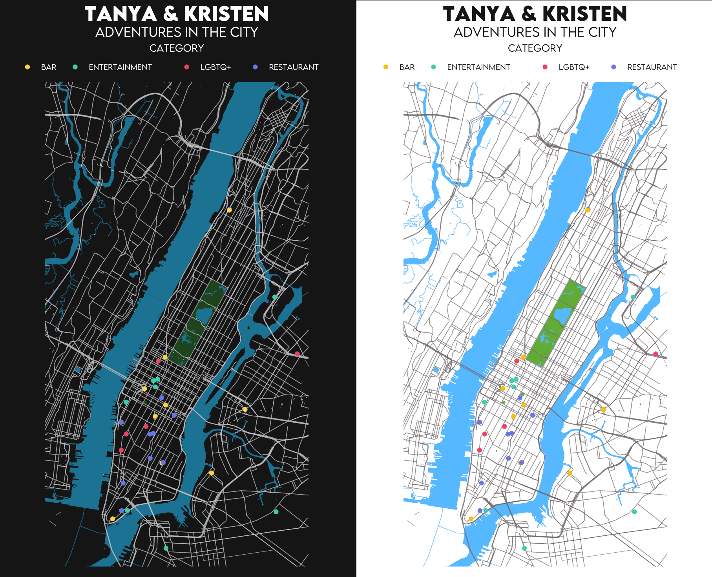
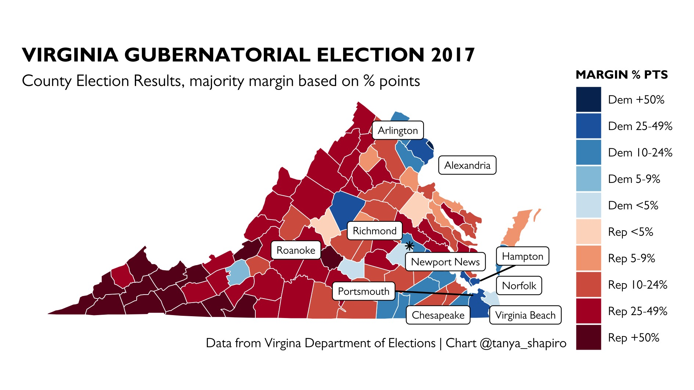
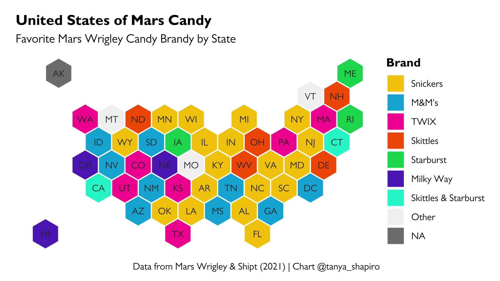
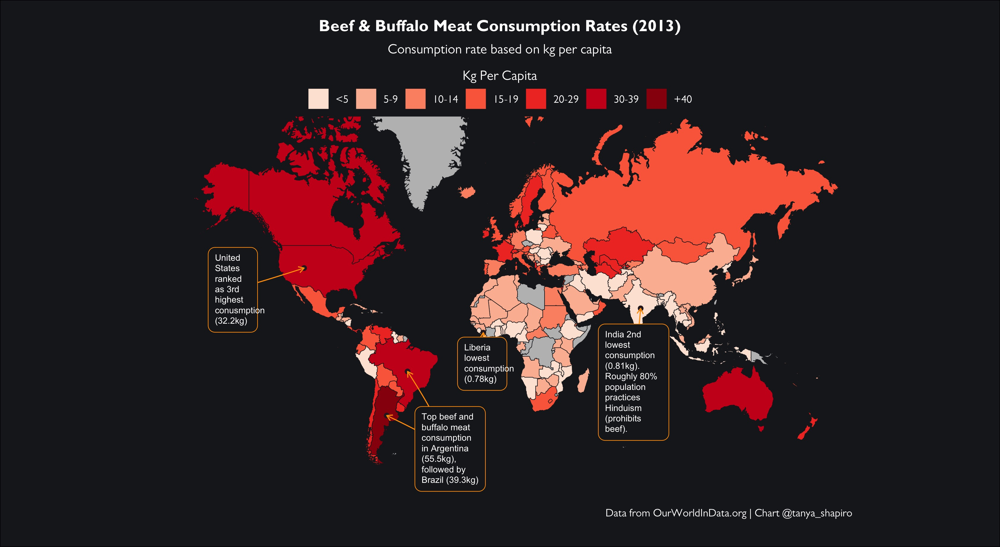
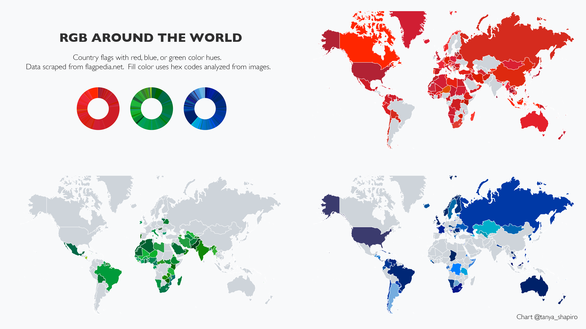
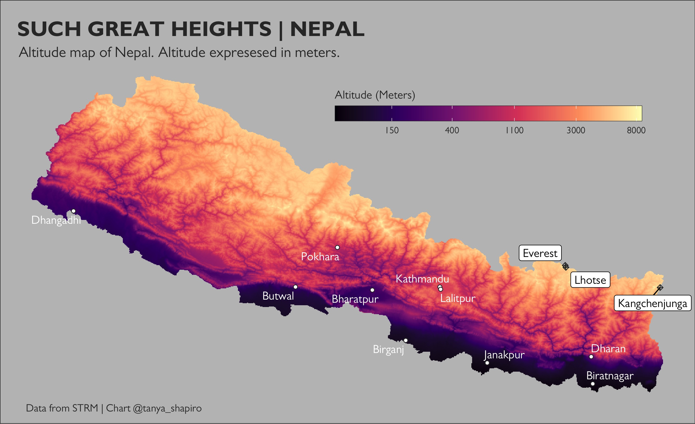
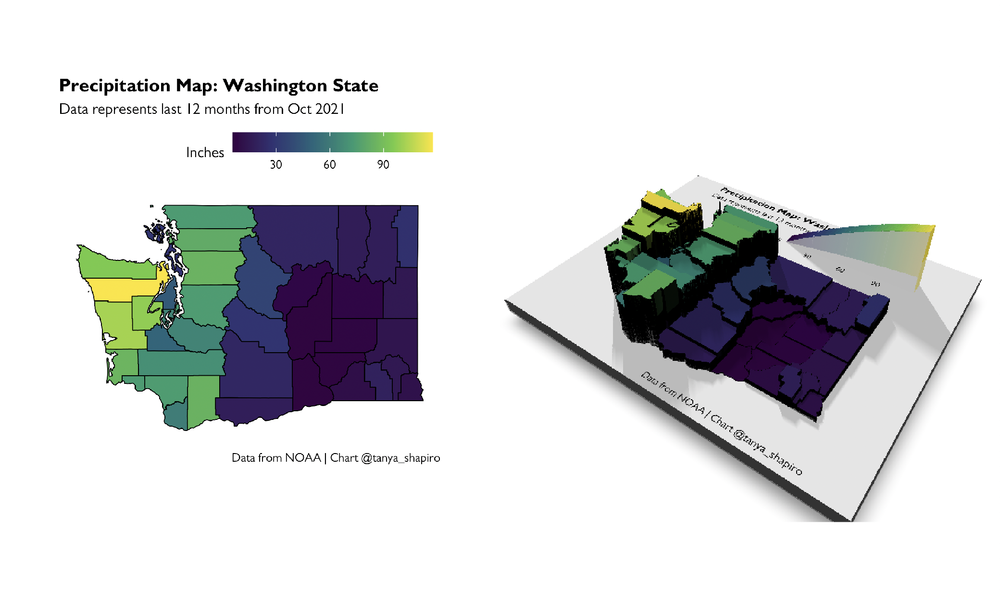
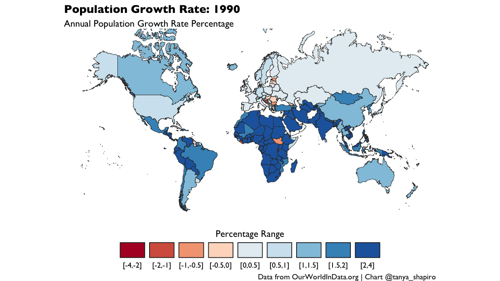

# 30 Day Map Challenge  

## :world_map: &nbsp; Challenge Summary 

List of map themes by day, taken from the 30DayMapChallenge [home page](https://github.com/tjukanovt/30DayMapChallenge), and content produced per challenge. 

| Day | Theme         | Map                                                            | Data                                                                                                                           |
|:---:|:--------------|:---------------------------------------------------------------|:-------------------------------------------------------------------------------------------------------------------------------|
| 1   | Points        | [Manhattan Adventures](manhattan-adventures)                   | [OpenStreetMap](https://www.openstreetmap.org/)                                                                                |
| 2   | Lines         | -                                                              | -                                                                                                                              |
| 3   | Polygons      | [Virginia Gubernatorial Election](va-governor-election)        | [VA Department of   Elections](https://www.elections.virginia.gov/resultsreports/election-results/)                            |
| 4   | Hexagons      | [Mars Candy Map](candy-hex-map)                                | [Mars Wrigley &   Shipt](https://www.candyindustry.com/articles/89963-whats-your-states-favorite-mars-wrigley-halloween-candy) |
| 5   | OpenStreetMap | [Basel, Switzerland](basel-openstreetmap)                      | [OpenStreetMap](https://www.openstreetmap.org/)                                                                                |
| 6   | Red           | [Beef Consumption](red-beef-map)                               | [OurWorldInData.org](https://ourworldindata.org/grapher/beef-and-buffalo-meat-consumption-per-person)                              |
| 7   | Green         | California Dispensaries                                        | [Department of Cannabis Control CA](https://cannabis.ca.gov/)                                                                  |
| 8   | Blue          | [RGB Flags Around The World](flag-rgb-map)                     | [flagpediat.net](https://flagpedia.net/)                                                                                       |
| 9   | Monochrome    | -                                                              |                                                                                                                                |
| 10  | Raster        | [Such Great Heights (Altitude Map of Nepal)](raster-nepal-map) | [SRTM](https://srtm.csi.cgiar.org/)                                                                                            |
| 11  | 3D        | [Washington State Rainfall](3D-washington-map) | [NOAA](https://www.ncdc.noaa.gov/cag/county/mapping)                                                                                           |
| 12  | Population | [Population Growth Rate](population-map) | [OurWorldInData.org](https://ourworldindata.org)                                                                                           |

## **Day 1 & 2 - Points & Lines | [Manhattan Adventures](manhattan-adventures)**
This map is a love letter to my better half, Kristen. We spent two years living together in New York City, and over those two years we created a lot of great memories. This map outlines some of our favorite date spots and places. Map created using ggplot and OpenStreetMap (osmdata) library.

## **Day 3 - Polygons | [Virginia Gubernatorial Election 2017](va-governor-election)**
Throwback to the last Virginia Gubernatorial Election. Election results by county. Data set from the Virgina Department of Elections. Map created using ggplot and R maps library (county map shapes).

## **Day 4 - Hexagons | [Mars Candy Favorites 2021](candy-hex-map)**
November 4th is National Candy Day. Dedicating this map to all the Mars candy fans. Snickers is the clear favorite country wide!

## **Day 5 - OpenStreetMap | [Basel, Switzerland](basel-openstreetmap)**
Used R osmdata library along with ggplot to render a map of my hometown, Basel, Switzerland. 

## **Day 6 - Red | [World Beef & Buffalo Consumption by Country (2013)](red-beef-map)**

## **Day 6, 7, 8 - Red, Green, Blue | [RGB Around The World](flag-rgb-map)**
Map explores different red, green, and blue hex colors of flags around the world. Data set created by scraping data from flagpedia.net and analyzing data using colorfindr.

## **Day 10 - Raster | [Such Great Heights (Nepal Altitude Map)](raster-nepal-map)**
Used altitude data from STRM (raster getData alt) to generate an altitude map of Nepal, home of the tallest mountains.

## **Day 11 - 3D | [Washington State Rainfall](3D-washington-map)**
First attempt with 3D mapping using #RStats rayshader library. Precipitation data from [NOAA](https://www.ncdc.noaa.gov/cag/county/mapping), county map data from tigris.

## **Day 12 - Population | [Population Growth Rate](population-map)**
Annual population growth rate over time, spans the last 3 decades (1990-2020). Data from OurWorldInData.org.

