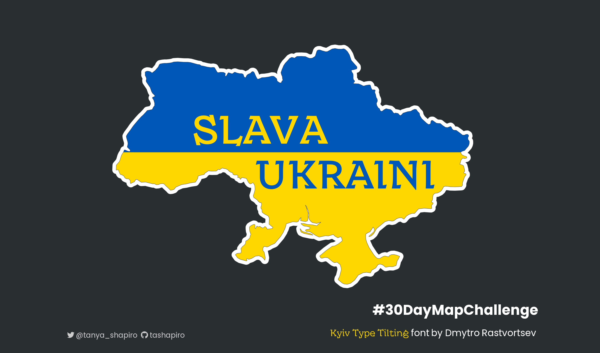

# #30DayMapChallenge

The information displayed below is for 2022 #30DayMapChallenge. You can also explore my work from last year's challenge [here](./2021).

## Overview

## :world_map:   Challenge Summary

| Day | **Theme**             | **Map**           | Data Source          |
|:---:|-----------------------|-------------------|----------------------|
|  1  | Points                | Taylor Swift Tour | Taylor Swift Events  |
|  2  | Lines                 | The Road to Sal   | Google Maps & Peloton|
|  3  | Polygons              | \-                |              |
|  4  | Color Friday: Green   | \-                |              |
|  5  | Ukraine               | Slava Ukraini     | Natural Earth|
|  6  | Network               | \-                |              |
|  7  | Raster                | \-                |              |
|  8  | Data: Open Street Map | \-                |              |
|  9  | Space                 | \-                |              |
| 10  | A bad map             | \-                |              |
| 11  | Color Friday: Red     | \-                |              |
| 12  | Scale                 | \-                |              |
| 13  | 5 minute map          | \-                |              |
| 14  | Hexagons              | \-                |              |
| 15  | Food/Drink            | \-                |              |

## Gallery

### Day 1 - Points \| Taylor Swift The Eras Tour

### Day 2 - Lines \| The Road to Sal

### Day 5 - Ukraine \| Slava Ukraini

